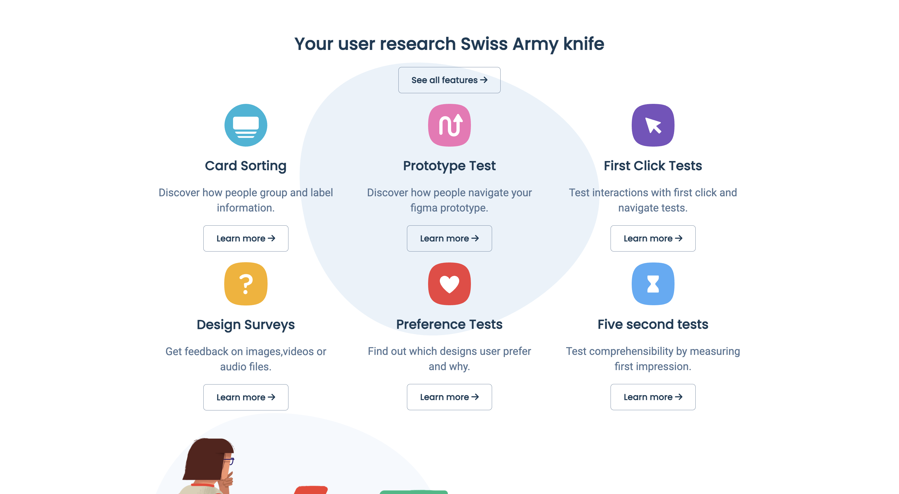
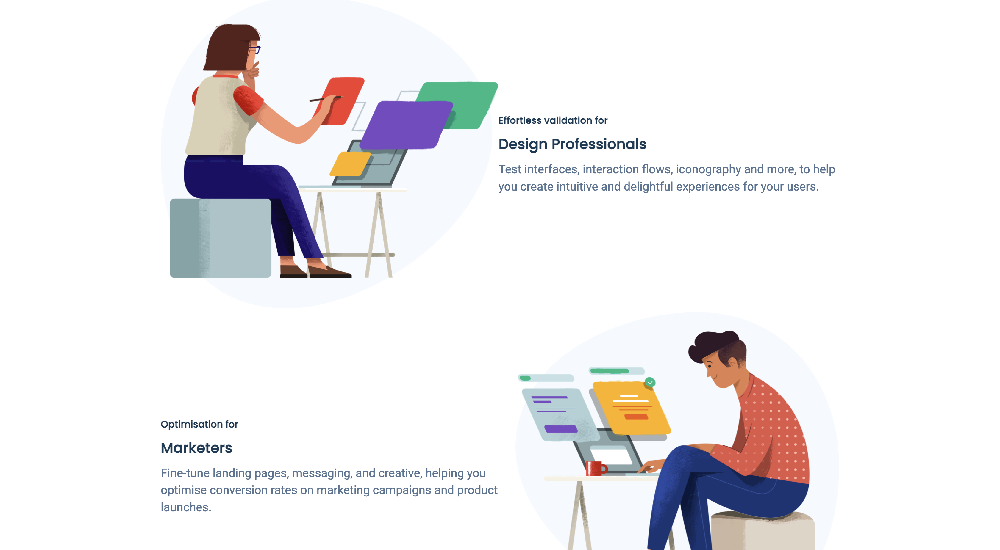

# 🎨 UsabilityHub Clone (Responsive Website)

A responsive clone of the **UsabilityHub Website**, built using only **HTML & CSS**.
This project showcases a modern agency/company-style website with sections for services, customers, and call-to-action.

---

## 📸 Preview

---

## 🚀 Features
- Fully responsive design (mobile, tablet, desktop) 📱💻
- Modern agency/SAAS-style landing page ✨
- Clean and reusable HTML structure 🧩
- Pure CSS for styling (no frameworks used) 🎨
- Sections included:
  - Hero section with call-to-action
  - Customers/Partners logos
  - Features section
  - CTA buttons
  - Responsive navigation

---

## 🛠️ Tech Stack
- **HTML5**
- **CSS3 (Flexbox, Media Queries)**

---

## ⚡ Live Demo
👉 [View on GitHub Pages]()

*(This link will work after you push the project and enable GitHub Pages.)*

---

## 🤝 Contributing
This is a beginner project built for learning purposes.
Feel free to fork it, improve it, or add new features! 🚀

---

## 📜 License
This project is licensed under the MIT License.
You’re free to use, modify, and distribute it.

---
### 🙌 Acknowledgements
- Inspired by the [YouTube Tutorial](https://www.youtube.com/watch?v=izqV9kZPOMY&t=424s)
- Thanks to UsabilityHub for the design inspiration.
